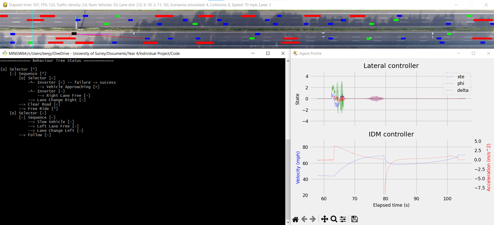
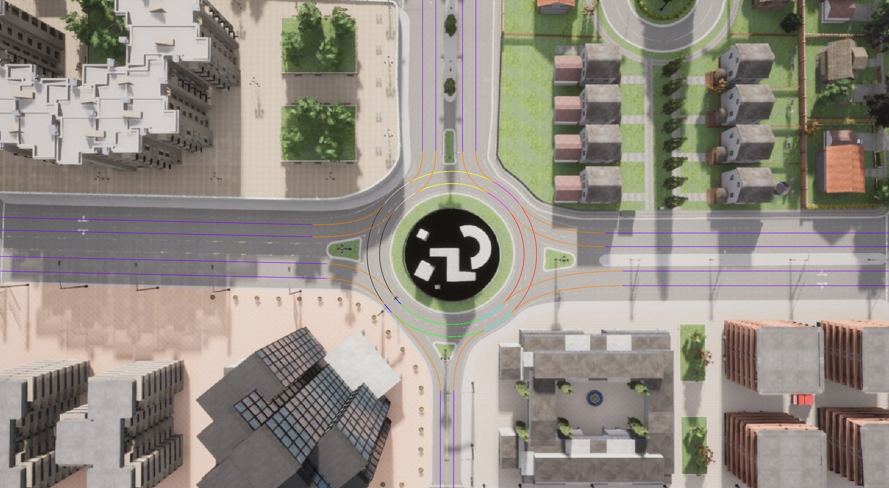

# Autonomous Highway Driving Using Behaviour Tree

This project simulates the driving behaviour of an autonomous car using the behaviour tree decision-making algorithm.
Two scenarios are considered. 
1. Navigating traffic on a 3-lane highway.
2. Navigation of a 2-lane roundabout.

## Dependencies
- control==0.9.3.post2
- matplotlib==3.7.1
- networkx==3.1
- numpy==1.24.2
- pqdict==1.2.0
- py_trees==2.2.3
- pygame==2.2.0
- pygraphviz==1.10
- scipy==1.10.1
- transpose_dict==1.1.3

## Usage
Run the simulation by executing either "highway_main.py" or "roundabout_main.py".

### Highway Scenario

### Roundabout Scenario

## Visuals
Visuals for the highway scenario: 
- Pygame window (top)
- Live behaviour tree state (left)
- Live agent data (right)

Road network for the roundabout scenario

